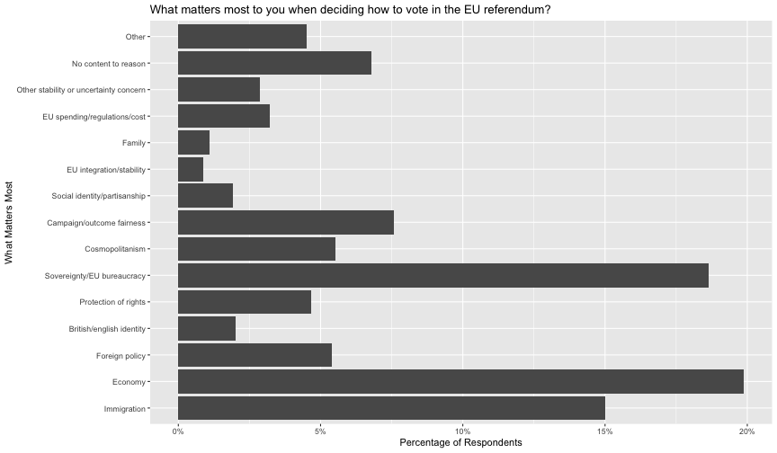
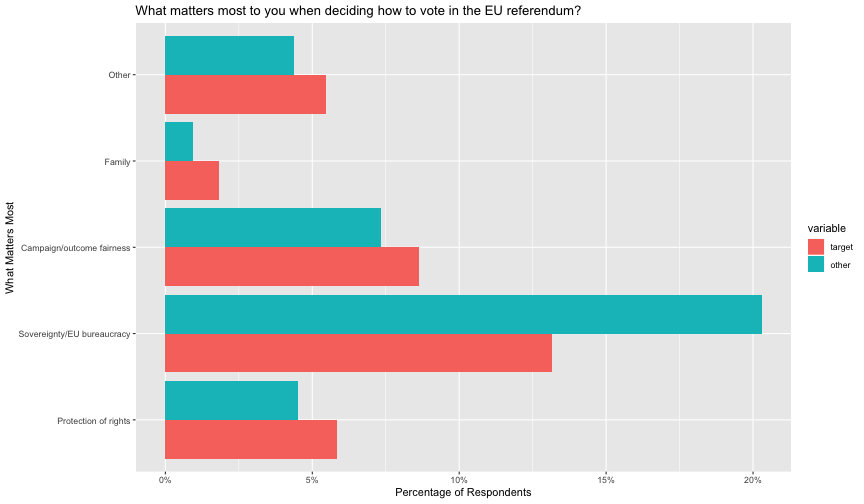
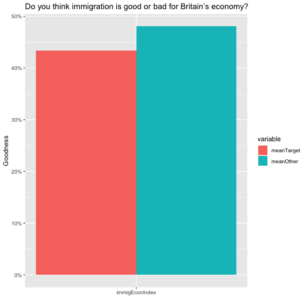
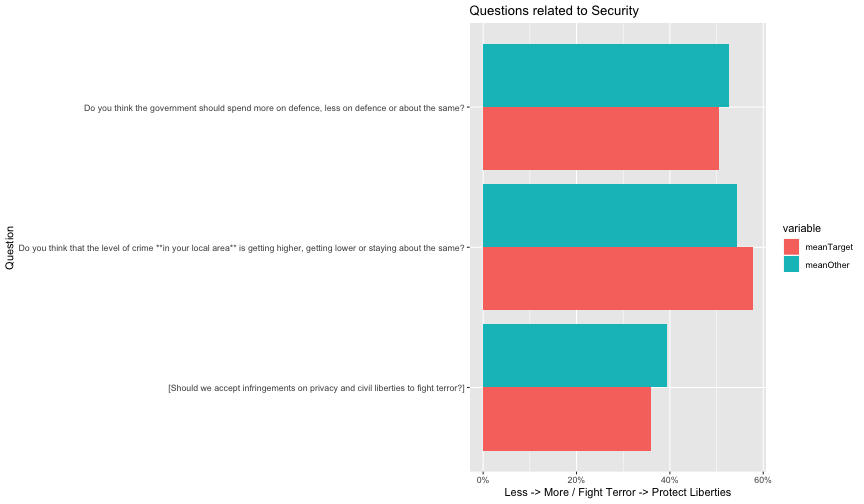
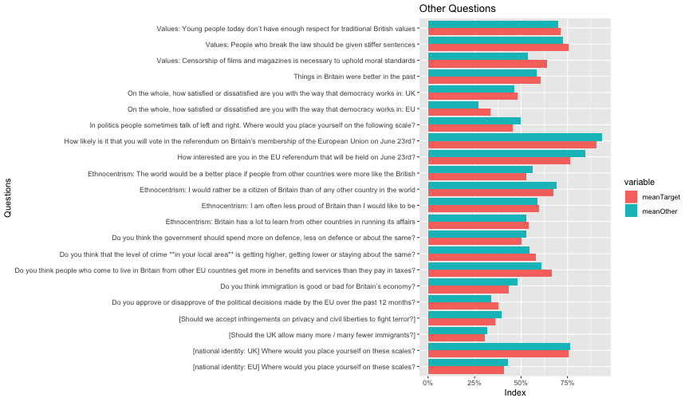

Women on Brexit in the British Election Study
========================================================
author: Dr John Lees-Miller
date: 22 Jul 2018
autosize: true

Summary: Motivation
========================================================

- Eloise identified women aged 30-55 as an important demographic in the 'squishy middle'.
- We want to reach this demographic. It may help to understand their views and how they differ from those of the nation as a whole.
- The British Election Study surveyed ~30k people in April-June 2016, before the Brexit vote. It asked questions about peoples' views on Brexit (among other things). (There are also more recent updates with fewer Brexit-related questions.)

Summary: Preliminary Results
========================================================

Things that mattered most in the referendum:

- Stronger interest in family, fairness, protection of rights
- Weaker interest in Sovereignty / EU bureaucracy

In general, compared to the nation as a whole:

- More concerned about impact of immigration on jobs
- More concerned about security, crime and safety
- Generally more conservative
- Less politically engaged / interested

(*) Subject to many caveats...

Distribution of Respondents
========================================================

- There are many in Scotland and Wales.

Validation: Topics of Interest
========================================================

We brainstormed some topics we think women 30-55 may more be interested in. Do the data agree?

- Family
- Health
- Education
- Jobs
- Lifestyle, Food
- Security, Property

What matters most to you when deciding how to vote in the EU referendum?
========================================================

- The survey asked this question directly.
- It was free text, which BES coded into 15 categories.
- What were the main reasons for the nation as a whole?
- What reasons were more or less important for women (30-55)?
   - Run t-tests to find which differences are statistically significant (p=0.05).

For the nation as a whole
========================================================

For Women 30-55 (Target)
========================================================

Other Topics
========================================================

- Could not find much data on Health, Education, Lifestyle / Food
- Did find some on Jobs and Security

Jobs (and Economy)
========================================================

Security (and Crime)
========================================================

Other
========================================================

Next Steps
========================================================

- Look at regions --- enough data to go to NUTS1 / NUTS2?
- Have consituencies --- enough data to comment on swing constituencies as a whole?
- Look at later 'waves'
- Look for more questions. There are 291 pages of notes and explanations at http://www.britishelectionstudy.com/wp-content/uploads/2017/07/Bes_wave13Documentation_V1.0.pdf
- Interesting related report: https://www.fawcettsociety.org.uk/Handlers/Download.ashx?IDMF=049e3458-12b0-4d0f-b0a6-b086e860b210
